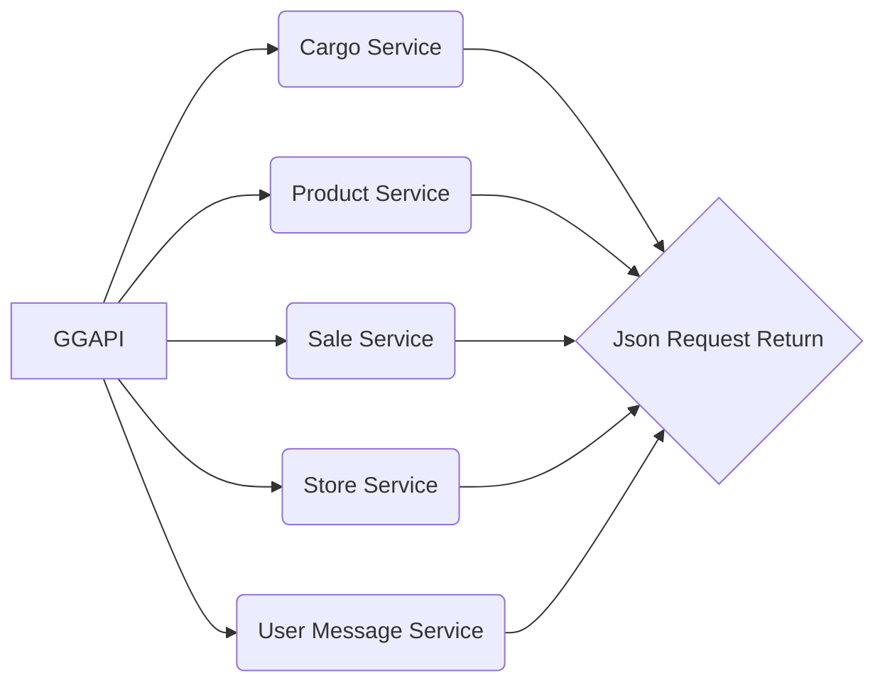

# GittiGidiyor API
This API created _by_ **Zamion101** for public use because of worst documentation on https://dev.gittigidiyor.com


## How to use:

```python
import GGAPI

api = GGAPI.GGPAI('username','password','api_key','secret_key')

"""
>username: Developer username
>password: Developer password (not GittiGidiyor account password!)
    -> if you don't have Developer account contact with **api.destek@gittigidiyor.com**
>api_key: API key from your GittiGidiyor application (you can find or create in https://dev.gittigidiyor.com)
>secret_key: You can find or create as same as api_key
"""

cargoService = api.getCargoService()
productService = api.getProductService()
saleService = api.getSaleService()
storeService = api.getStoreService()
userMessageService = api.getUserMessageService()

"""
You can find all available methods with
print(dir(<serviceObject (like cargoService)>))
>>>
['__class__', '__delattr__', '__dict__', '__dir__', '__doc__', '__eq__', '__format__', '__ge__', '__getattribute__', '__gt__', '__hash__', '__init__', '__init_subclass__',
'__le__', '__lt__', '__module__', '__ne__', '__new__', '__reduce__', '__reduce_ex__', '__repr__', '__setattr__', '__sizeof__', '__str__', '__subclasshook__',
'__weakref__', 'auth', 'base_url', 'getCargoInformation', 'requestURL', 'request_type', 'sendCargoInformation', 'session', 'signature', 'timestamp', 'type']

"""
saleService.getActiveSales()
"""
(this return is beautified not real result is like that)
>>>
{
  "ackCode": "success",
  "responseTime": "2019-05-22 23:18:39",
  "timeElapsed": "11 ms",
  "count": "1",
  "itemList": {
    "item": {
      "productId": "445329567",
      "title": "App Test",
      "productLink": "https://urun.gittigidiyor.com/app-test_W0QQidZZ445329567",
      "format": "S",
      "buyNowPrice": "0.1",
      "highPrice": "0.0",
      "productCount": "9999",
      "soldProductCount": "0",
      "remainingTime": "55 gün : 18 s : 53 dk",
      "bidCount": "0",
      "watcherNumber": "0",
      "thumbImageLink": "https://mcdn01.gittigidiyor.net/44532/tn9/445329567_tn9_0.jpg"
    }
  }
}
...
"""
```




